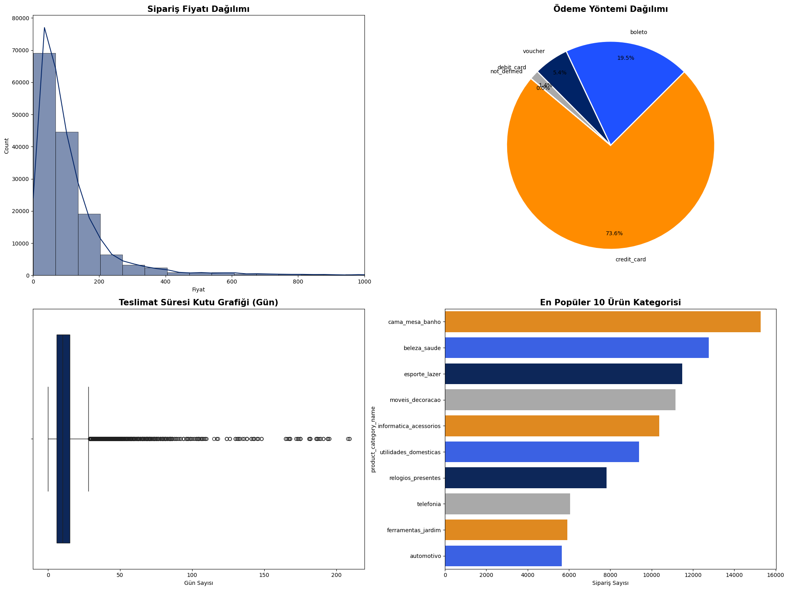
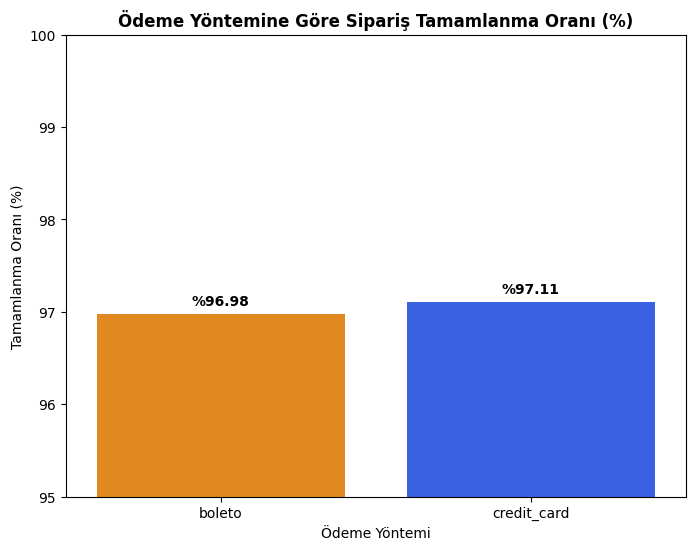
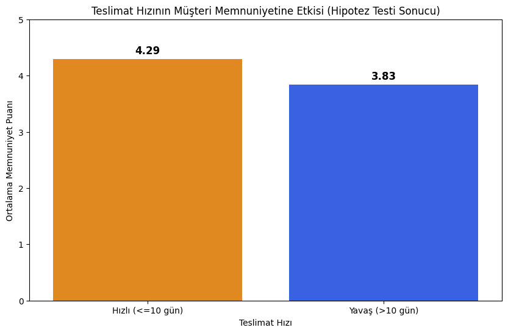
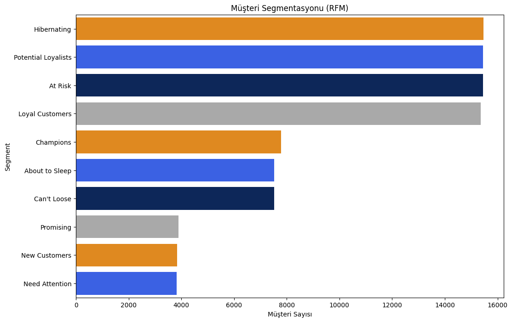

# Olist E-Commerce Data Analysis

## Project Overview
This project analyzes the Olist Brazilian e-commerce dataset to extract business insights related to customer behavior, payment methods, delivery performance, and product categories.

## Tools & Technologies
- Python (Pandas, NumPy, Matplotlib, Seaborn)
- Google Colab
- Statistical Analysis
- Data Visualization

## Key Analyses
- Data loading and preprocessing  
- Exploratory data analysis (EDA)  
- Order price distribution analysis  
- Payment method analysis  
- Delivery time analysis  
- Correlation matrix  
- Hypothesis testing (p-value)  
- Customer satisfaction analysis  
- RFM customer segmentation  
- Time series analysis on customer reviews  
- Product category performance analysis  
- Low-rated review analysis  

## Insights
- Analyzed the relationship between delivery time and customer satisfaction  
- Identified dominant payment methods  
- Discovered top-performing product categories  
- Detected pricing outliers  
- Segmented customers using RFM methodology  
- Extracted insights from low-rated customer reviews  

## Outcome
Provided data-driven recommendations to improve:
- Customer experience  
- Logistics performance  
- Sales strategy  

## Dataset
Olist Brazilian E-Commerce Dataset (Kaggle)

## Visual Highlights

**Order Price Distribution**  

---

**Payment Method Distribution**  

---

**Delivery Speed vs Customer Satisfaction**  

---

**RFM Customer Segmentation**  

## Contributors
- Selen İmahanoğlu  
- Begüm Yapıcıoğlu
- Ülkü Ülkü
